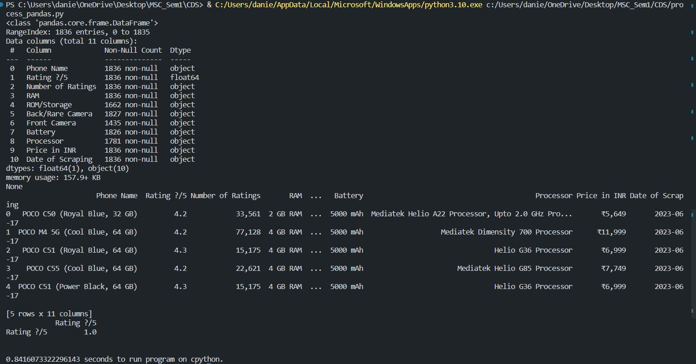
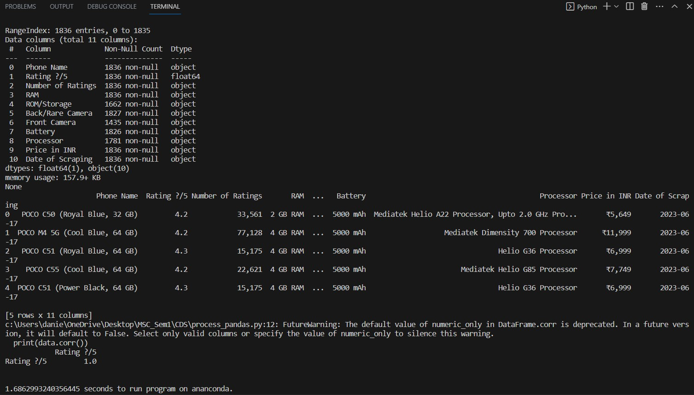
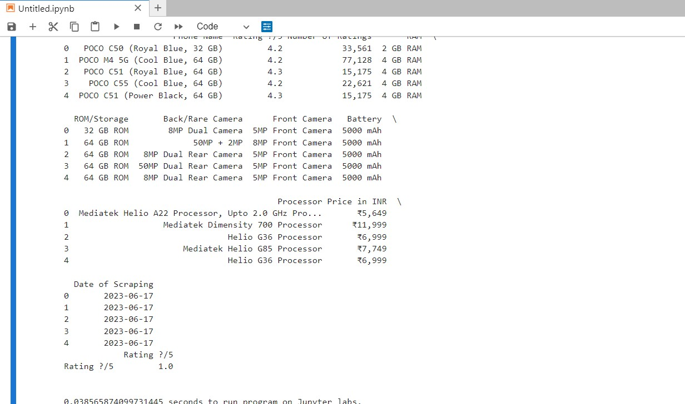
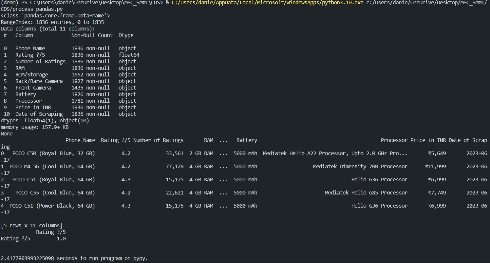

# Testing-Flavours-of-Python
A simple experiment to test which flavour of python is faster.  
 

# Dataset
We have used a mobile price dataset that shows the price of the mobile phone all with it's characteristics.  
 

# Program
The program used is one which uses pandas to read the dataset, display it's details and first few columns and finally calculates it's correlation.  
The time function of time module is used to calculate the time taken to run the program.  
 
 

# Step1: Using cpython
The first approach is to use the tradition cpython flavour to run the code.  
By running the program using cpython, the program took 0.84 seconds to run. 
   

  
 
 

# Step2: Using Anaconda on VS Code
The second approach uses anaconda run on VS Code.  
This approach took more time than the earlier approach taking 1.86 seconds.  
 

  
 
 

# Step3: Usimg Anaconda on Jupyter labs
The third approach was to use Jupyter lab to execute the program.  
This approach took the least time upto 0.03 seconds.
 

  
 
 

# Step4: Usimg PyPy
The final approach was by using PyPy.  
This approach took the most time of 2.41 seconds
 

  
 
 

# Conclusion
Thus we can conclude that from all the flavours of python used in this experiment, running python on Anaconda using Jupyter labs is the fastest.

